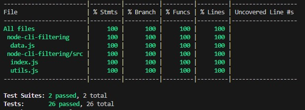

# node-cli-filtering
CLI for filtering and counting element inside a tree 

## Command
```javascript
npm run test
npm run test:watch
npm run test:coverage 
```

## Usage
```shell
node app.js --filter=ry
node app.js --count
node app.js --filter=ry --count
```

## Coverage
